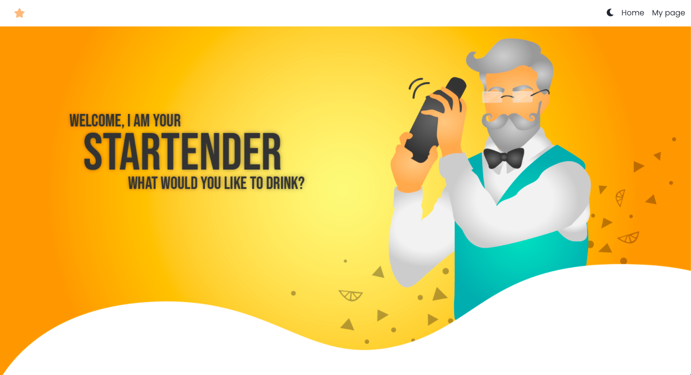
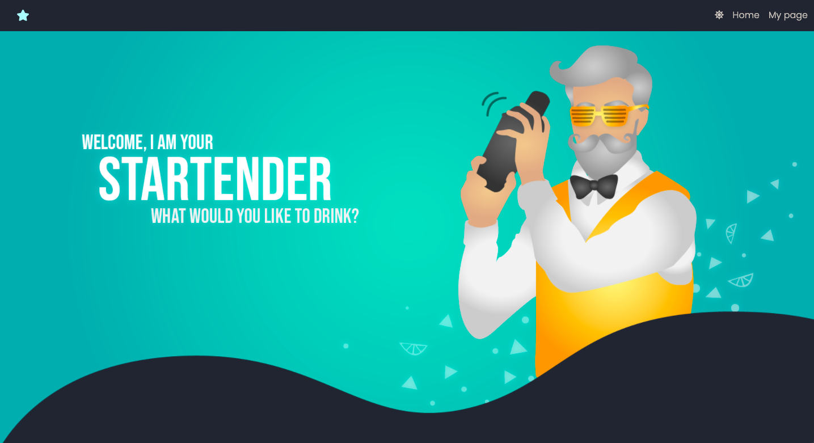
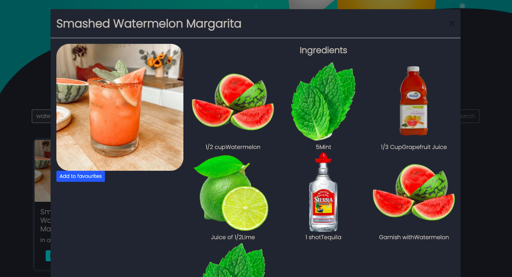
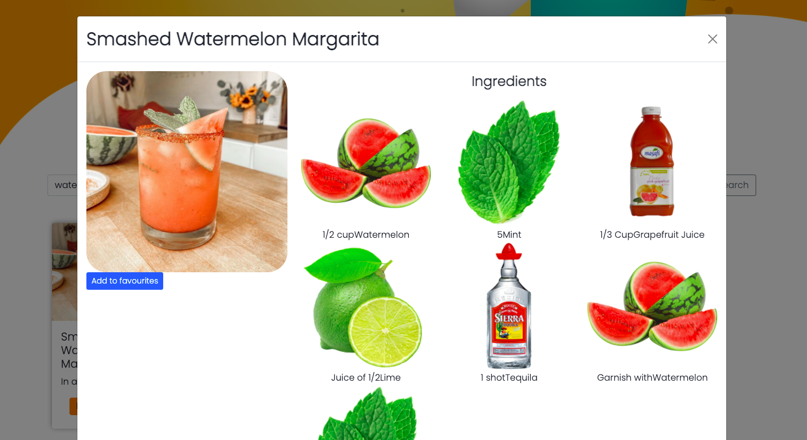
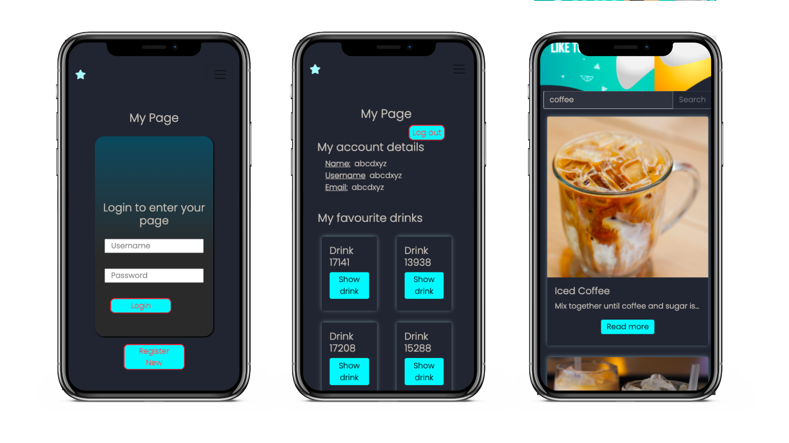
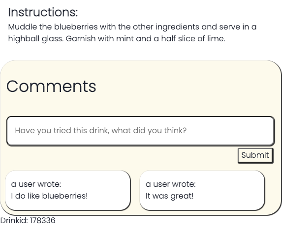
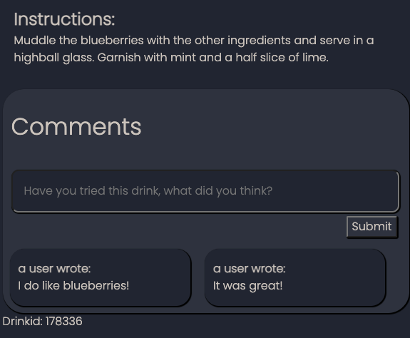

# Welcome to Startender!
A project made for the course DH2643 Advanced interaction programming, at KTH.

<!-- TABLE OF CONTENTS -->
### Table of Contents
  <ul>
    <li>
      <a href="#about-the-project">About The Project</a>
      <ul>
        <li><a href="#built-with">Built With</a></li>
      </ul>
    </li>
    <li>
      <a href="#to-get-started">To get started</a>
    </li>
  </ul>
 

---
<!-- ABOUT THE PROJECT -->
# About The Project

_The Startender_ is your digital bartender - just search for whatever you feel like drinking and the startender will suggest a delicious cocktail recipe. You can also create your own profile, comment on drinks, read other users comments and save your favorite drinks for future access. The app was built as a part of the course DH2643 Advanced interaction programming, at KTH Royal Institute of Technology. The page is deployed through Heroku and Netlify, and you can visit it at [startender.netlify.app](https://startender.netlify.app/). 

 _The landing page in light mode._

 _The landing page in dark mode._

Every drink comes with an image, a recipe, including images of all the different ingredients and comments from other users. Just click the "Read mode" button.

|   |  |
|--- | --- |
|   |   |
_Drink modal in dark and light mode_

The page is fully responsive and works for both mobile and desktop users.


_A user logging in from mobile, visiting My Page and Home Page_

|   |  |
| ------------- | ------------- |
|   |   |

_The comment section in light and dark mode_

<p align="right">(<a href="#top">back to top</a>)</p>

____

## Built With

### Frontend
* Typescript
* React
* Redux-thunk
* Sass
* Formik

## Backend
* Node JS
* Express JS

## Database
*  mongoDB
* [The Cocktail DB](https://www.thecocktaildb.com/)

## Deployment
* Backend: hosted with [Heroku](https://thestartender.herokuapp.com/)
* Frontend: hosted with [Netlify](https://startender.netlify.app/)

<p align="right">(<a href="#top">back to top</a>)</p>

----

# To get started: 


Download the repo. 

Run 
```
npm install
```

in the backend directory as well as in client, in order to get the necessary packages for this app. 

A .env folder is also needed in order to run this, contact us for this.


In the backend directory, run
```
npm start
```

In the client directory, run

```
npm run dev
```

and the app will be run locally at http://localhost:3000/


<p align="right">(<a href="#top">back to top</a>)</p>
